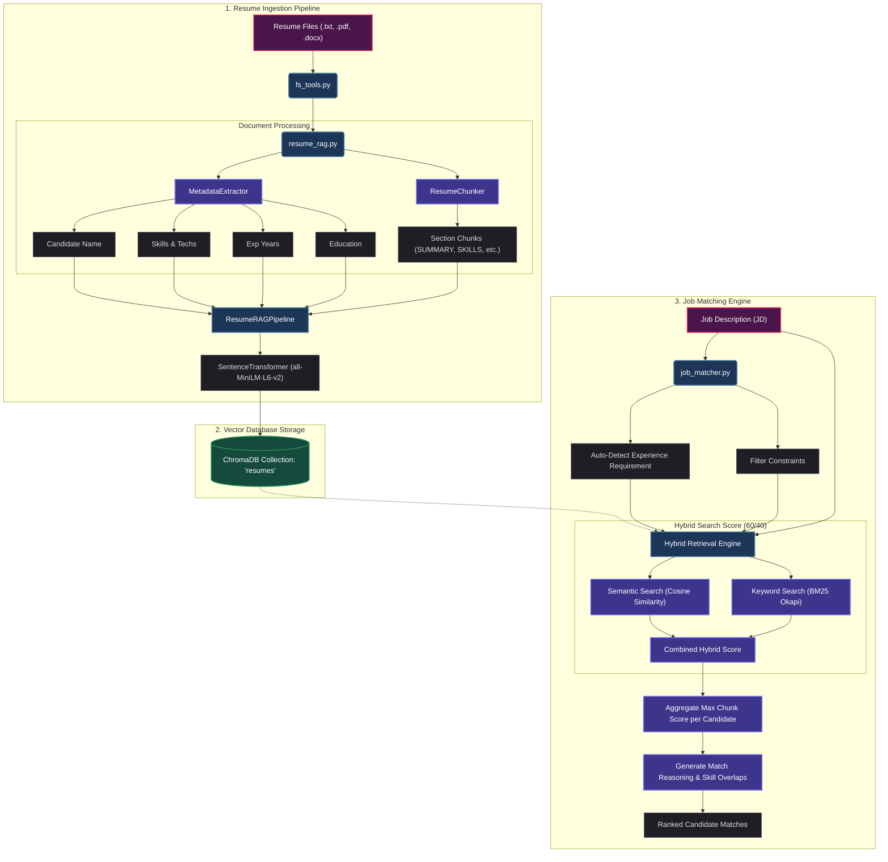

# RAG-Based Profile Matching Engine

## Overview

This project implements a Retrieval-Augmented Generation (RAG) profile matching engine that maps candidate resumes against job descriptions (JDs). It combines dense semantic retrieval (via ChromaDB and Sentence Transformers) with sparse lexical retrieval (via BM25) to perform robust **hybrid search**. It extracts structured metadata (Candidate Name, Skills, Experience Years, Education) from multiple file formats (`.txt`, `.docx`, `.pdf`) and utilizes them for strict filter bounds.

---

## Core Architecture

### System Flow & Architecture



---

### 1. File Access Layer (`fs_tools.py`)

- Reuses the robust file extraction functions from ([llm_file_system_assistant](https://github.com/shashankch/llm_file_system_assistant)).
- Supports reading text content and metadata from `.txt`, `.pdf` (via `pypdf`), and `.docx` (via `python-docx`) files.

### 2. Document Processing Pipeline (`resume_rag.py`)

- **Metadata Extraction**:
  - **Candidate Name**: Parsed dynamically via naming convention heuristics or text structure fallbacks.
  - **Skills**: Extracted using word boundaries and lookup heuristics against a pre-defined catalog of 60+ technologies.
  - **Experience Years**: Parsed utilizing case-insensitive regex patterns (e.g. `X+ years`, `X yrs exp`).
  - **Education**: Scans education headers and patterns for university degree labels.
- **Section Chunking**: Splits resumes into coherent chunks preserving critical sections (e.g. SUMMARY, SKILLS, EXPERIENCE, EDUCATION) to maintain semantic context.
- **Embedding & Storage**: Vectorizes resume chunks using a SentenceTransformer model (default: `all-MiniLM-L6-v2`, with full support for custom models) and persists them alongside metadata in a local ChromaDB collection (default: `resumes`).

### 3. Job Matching Engine (`job_matcher.py`)

- **Hybrid Search**: Computes a combined match score (60% semantic cosine similarity + 40% normalized BM25 score) scaled to `0-100` using the specified collection and embedding model.
- **Constraint Filtering**: Filters out candidates who do not satisfy minimum experience or must-have skill requirements.
- **Match Reasoning**: Explains which sections had the highest relevance overlaps and details matches for key skills.

---

## Project Layout

```text
rag_profile_matching/
├── src/
│   ├── config.py             # Global paths and model configurations
│   ├── eval_config.py        # Evaluation ground truth and embedding benchmark configurations
│   ├── fs_tools.py           # Reused filesystem tools from "gh/shashankch/llm_file_system_assistant"
│   ├── resume_rag.py         # Section chunking and database ingestion
│   ├── job_matcher.py        # Hybrid query matching and ranking
│   └── generate_dataset.py   # Dataset generation helper
├── notebooks/
│   ├── evaluation.ipynb      # Experimentation notebook
│   └── run_eval.py           # Command-line benchmark script
├── tests/
│   └── test_matcher.py       # Automated unit test suite
├── data/
│   ├── resumes/              # 31 generated resume documents (.txt, .docx, .pdf)
│   └── job_descriptions/     # 5 job description test files
├── requirements.txt          # Python dependencies
└── README.md                 # Project documentation
```

---

## Setup & Ingestion

### Setup the Environment

You can configure the project using either `uv` or standard Python tools.

#### Option A: Using `uv` (Recommended)

```bash
# Create and activate environment
uv venv .venv
source .venv/bin/activate

# Install dependencies
uv pip install -r requirements.txt
```

#### Option B: Using Standard Python and Pip

```bash
# Create and activate environment
python3 -m venv .venv
source .venv/bin/activate  # Or .venv\Scripts\activate on Windows

# Install dependencies
pip install -r requirements.txt
```

### Execution Steps

Follow these steps to run the pipeline end-to-end:

#### 1. Generate the Dataset

Create the mock resumes (31 files covering different extensions) and job descriptions:

```bash
python src/generate_dataset.py
```

#### 2. Ingest the Resumes

Index the resume chunks and metadata in ChromaDB:

```bash
python src/resume_rag.py
```

#### 3. Run a Query Test

Query the matching engine using the default CLI job description:

```bash
python src/job_matcher.py
```

#### 4. Run the Benchmarks & Evaluation Suite

Execute the performance benchmarking script to view latencies and matching quality:

```bash
python notebooks/run_eval.py
```

#### 5. Run Unit Tests

Execute the unit tests verifying metadata extraction and section chunking:

```bash
python tests/test_matcher.py
```

---

## Example

```json
Loading weights: 100%|███████████████████████████████████████████████| 103/103 [00:00<00:00, 9225.14it/s]
Matching JD: 'Looking for a Python developer with 3+ years experience and knowledge of Docker/Kubernetes.'
Auto-detected experience requirement from JD: 3+ years
No explicit must-have skills filter applied.
{
  "job_description": "Looking for a Python developer with 3+ years experience and knowledge of Docker/Kubernetes.",
  "top_matches": [
    {
      "candidate_name": "Marcus Wright",
      "resume_path": "/Users/shashank/Dev/AI/rag_profile_matching/data/resumes/resume_marcus_wright.docx",
      "match_score": 60,
      "matched_skills": [],
      "relevant_excerpts": [
        "Full Stack Developer with 3+ years of experience. Full Stack Engineer specializing in the MERN stack with 3 years of experience building web applications.",
        "Full Stack Developer at ProjectAngel (2023-Present)\n- Created user-facing features using React.\n- Designed backend services using Node.js and Express."
      ],
      "reasoning": "Candidate possesses 3 years of experience (education: 'B.S. in Computer Science, UT Austin'). Highest matching content was found in sections: SUMMARY."
    },
    {
      "candidate_name": "John Doe",
      "resume_path": "/Users/shashank/Dev/AI/rag_profile_matching/data/resumes/resume_john_doe.pdf",
      "match_score": 60,
      "matched_skills": [
        "Docker",
        "Python"
      ],
      "relevant_excerpts": [
        "Backend Developer with 5+ years of experience. Backend Developer with 5 years of experience\nbuilding APIs, managing databases, and containerizing software.",
        "Python, FastAPI, SQL, PostgreSQL, Docker, Git, REST API"
      ],
      "reasoning": "Strong skill overlap for Docker, Python. Candidate possesses 5 years of experience (education: 'M.S. in Computer Science, Georgia Tech'). Highest matching content was found in sections: SUMMARY."
    },
    {
      "candidate_name": "Diana Prince",
      "resume_path": "/Users/shashank/Dev/AI/rag_profile_matching/data/resumes/resume_diana_prince.txt",
      "match_score": 53,
      "matched_skills": [
        "Python"
      ],
      "relevant_excerpts": [
        "Product Manager with 8+ years of experience. Technical Product Manager with a strong software engineering background, managing roadmap and release cycles for cloud products.",
        "Git, Python, SQL, Jira, AWS"
      ],
      "reasoning": "Strong skill overlap for Python. Candidate possesses 8 years of experience (education: 'Not Specified'). Highest matching content was found in sections: SUMMARY."
    },
    ....
  ]
}
```

---

## Matching Performance & Embedding Benchmarks

We evaluate the matching engine across the 5 job descriptions using standard Information Retrieval (IR) metrics: **Precision@K**, **Recall@K**, **Mean Average Precision (MAP)**, and **Mean Reciprocal Rank (MRR)**. 

### 1. Live Local Models Comparison
The evaluation suite runs three local HuggingFace/SentenceTransformers models under two distinct retrieval settings:
- **Filtered Mode:** Reflects engine behavior with strict experience and must-have skill checks active.
- **Unfiltered Mode:** Raw semantic ranking (disabling metadata filters to analyze soft matches).

| Model | Mode | Ingest Time | Avg Latency | P@1 | P@3 | R@3 | P@5 | R@5 | MAP | MRR |
|---|---|---|---|---|---|---|---|---|---|---|
| **all-MiniLM-L6-v2** | Filtered | ~7.95s | ~30.51ms | 0.60 | 0.53 | 0.45 | 0.36 | 0.49 | 0.52 | 0.60 |
| **all-MiniLM-L6-v2** | Unfiltered | ~7.95s | ~12.93ms | **0.80** | **0.60** | **0.65** | 0.40 | 0.69 | 0.75 | 0.83 |
| **bge-small-en-v1.5** | Filtered | ~40.37s | ~19.53ms | 0.60 | 0.53 | 0.45 | 0.40 | 0.56 | 0.55 | 0.60 |
| **bge-small-en-v1.5** | Unfiltered | ~40.37s | ~15.77ms | **0.80** | 0.53 | 0.59 | **0.48** | **0.96** | **0.79** | **0.85** |
| **paraphrase-MiniLM-L3-v2** | Filtered | ~31.08s | ~15.30ms | 0.60 | 0.47 | 0.39 | 0.32 | 0.43 | 0.49 | 0.60 |
| **paraphrase-MiniLM-L3-v2** | Unfiltered | ~31.08s | ~11.31ms | **0.80** | 0.47 | 0.52 | 0.40 | 0.83 | 0.71 | 0.84 |

### 2. Key Insights
- **Metadata Filtering Trade-off:** While filtered mode guarantees 100% compliance with hard constraints, it limits **Recall** (R@3: 0.39-0.45) by discarding borderline/highly-qualified candidates (e.g. 5 yrs experience for a 6+ yr JD). Disabling metadata filters yields **Recall@5 up to 0.96** via pure semantic match scores.
- **BGE Small Performance:** BAAI's `bge-small-en-v1.5` achieves the highest MAP (**0.79**) and Recall@5 (**0.96**) in unfiltered mode, making it the most robust local model, albeit with a higher ingestion latency due to its weight size.

---

## Public Benchmarks Comparison (Paid vs. Local Free)

Since proprietary paid API models cannot run locally without billing keys, we compare them based on public MTEB (Massive Text Embedding Benchmark) Retrieval scores:

| Model Name | Provider | Dimension | Cost per 1M Tokens | MTEB Retrieval Avg | Deployment Type | License |
|---|---|---|---|---|---|---|
| **text-embedding-3-small** | OpenAI | 1536 | $0.02 | 52.2 | API-based | Proprietary |
| **text-embedding-ada-002** | OpenAI | 1536 | $0.10 | 49.3 | API-based | Proprietary |
| **embed-english-v3.0** | Cohere | 1024 | $0.10 | **56.2** | API-based | Proprietary |
| **bge-small-en-v1.5** | BAAI | 384 | **$0.00 (Local)** | 51.1 | Local | MIT |
| **all-MiniLM-L6-v2** | SentenceTransformers | 384 | **$0.00 (Local)** | 41.95 | Local | Apache 2.0 |
| **paraphrase-MiniLM-L3-v2** | SentenceTransformers | 384 | **$0.00 (Local)** | 34.0 | Local | Apache 2.0 |

- **Quality:** Local `bge-small-en-v1.5` is highly competitive, performing on par with OpenAI `text-embedding-3-small` (51.1 vs. 52.2) and outperforming the classic `text-embedding-ada-002` (49.3) at zero token cost.
- **Data Privacy:** Running local models keeps sensitive candidate resume details completely self-hosted, ensuring compliance with data protection policies (e.g. GDPR) and eliminating network overhead to third-party endpoints.

